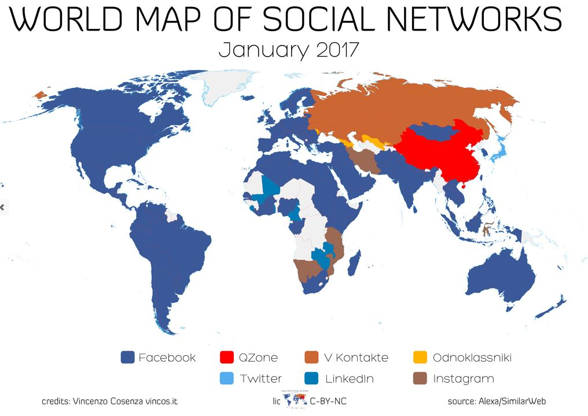
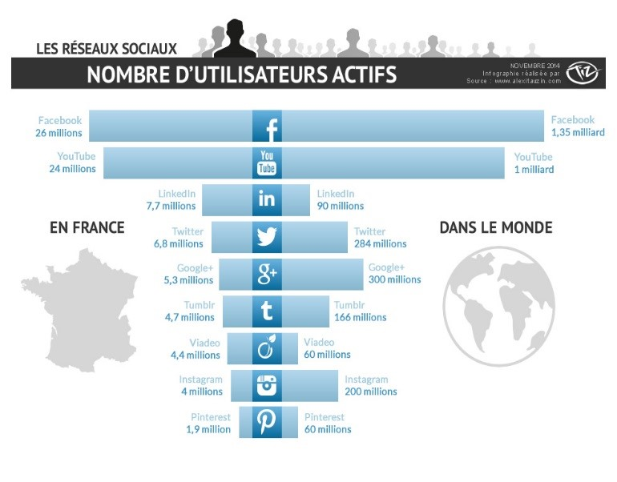
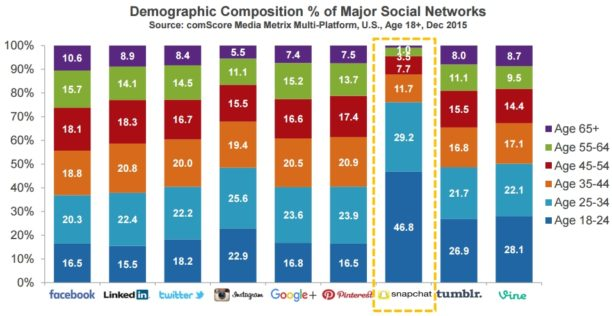
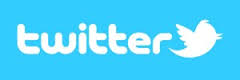
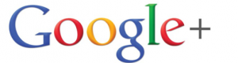
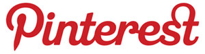
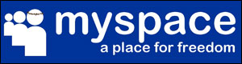
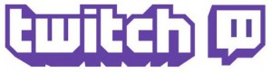
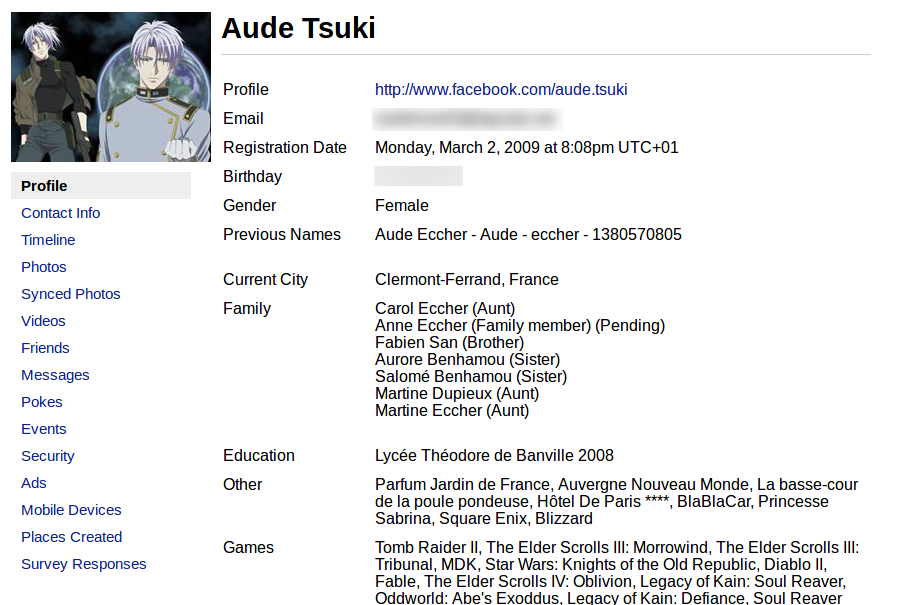
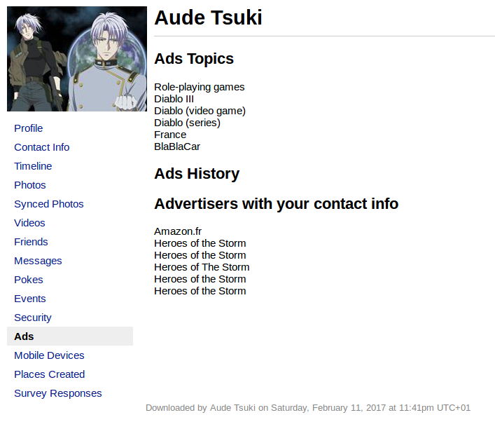

Les Réseaux Sociaux, Sécurité et vie privée

============================================================

Aspects Pratiques
=================
Participants
---
nombre participants  
---
4 personnes minimum  
10 personnes max  

encadrants
-----
minimum 1 pour 3 personnes 

Légende
=======

> Interactions avec le public

Matériel
========
Tableau ou paper board feutres 4 pc avec internet.  
Les PC doivent déjà avoir "*Ghostery*, *LightBeam*, *TermsofUse didn't read*, *LastPass*.  
Projecteur indispensable avec enceintes.  
Un bloc de Post-It.  

*********************************************************************************
Présentation
============
formation
---

* Face (fondation agir contre l'exclusion) est une association qui vise à réconcilier le monde de l'entreprise et les personnes exclues de l'emploi.
dans ce but l'association FACE Bourbornnais a permis la mise en place d'une école du numérique sur moulins. 

* Nous sommes en formation dév web.
Le développement web consite en la construction de site web et nécessite l'apprentissage de différents languages, comme le HTML, le CSS, le javascript et le PHP.

> Demander si précisions désirées ou si l'on se focalise sur les réseaux sociaux.

* Et dans ce cadre, cet atelier nous permettra d'apprendre à transmettre nos connaissances à un publique non spécialiste. Autrement dit d'apprendre à vulgariser des termes techniques et à s'exprimer clairement. 

 * Le thème de cet atelier nous concerne tous. Nous allons en effet vous faire découvrir la face cachée des réseaux sociaux. 

*********************************************************************************
Déroulement de l'atelier
---
* Présentation *(Aude)*
	* Formation
	* But de l'atelier
* Définitions *(Aude)*
* Présentation des principaux réseaux sociaux *(Stéphane)*
* Débat *(Emilie + / Aude -)*
	* Atelier de piratage *(Stéphane)*
	* Présentation des données présentes sur facebook *(Anthony)*
* Sécurisation
	* Paramètres facebook *(Stéphane)*
	* Présentation des outils de sécurisation et mise en évidence de la collecte de données *(Quentin)*
		* Terms of use
		* LightBeam
		* Ghostery
		* Duckduckgo
		* Lastpass, Keypass, Onepass
* Conclusion & Ouverture *(Mickaël)*

********************************************************************************

Atelier
======= 
> Qu'est-ce qu'un réseau social ?
> Résumer les réponses au tableau  

Correction par les encadrants :

* Les réseaux sociaux se définissent comme l'ensemble des moyens en ligne mis en oeuvre pour relier des personnes physiques ou morales entre elles.
Les applications qui compose ces réseaux sociaux servent à constituer un réseau social virtuel en reliant, par des liens hypertexte ou des bases de données, des identités visuelles.

* Ils permettent d'échanger en liberté, de partager des émotions, des informations, et de se divertir.

> Que connaissez vous comme réseaux sociaux?
Résumer les réponses au tableau  

Correction par les encadrants:

  
*Source: http://fr.slideshare.net/HlneDecourteix/quelle-place-pour-les-rseaux-sociaux-en-pharmacie*

  
*Source: http://www.blogdumoderateur.com/chiffres-reseaux-sociaux/*

  
**Le principe:** ce réseau permet de partager son status, des photos, des liens et des vidéos. Facebook est aussi utilisé par les entreprises, les artistes pour leur promotion grâce aux pages fans accessibles à tous.  
**Les raisons de s'inscrire:** la communauté est très importante, il est donc très facile d'y retrouver des membres de son entourage. C'est aussi un moyen de communiquer très efficace.  

  
**Le principe:** Twitter est un outil de microblogging qui permet d'envoyer des messages (ou "tweet") de 140 caractères aux internautes qui suivent chaque compte: les "followers" ou abonnés. Twitter est aussi très ouvert pour les entreprises.  
**Les raisons de s'inscrire:** pour suivre l'actualité en direct et également communiquer avec les entreprises.  

> **La différence entre Facebook et Twitter c'est que Facebook est un réseau social avec du contenu permanent tandis que Twitter affiche du contenu instantané.**  

  
**Le principe:** Instagram est une application mobile de partage de photo.  
**Les raisons de s'inscrire:** on peux retoucher en quelques secondes des clichés grâce à des filtres puis de les partager avec ses amis.  

  
**Le principe:** c'est une application mobile permettant d’envoyer des messages et photos éphémères ainsi que de passer des appels vidéo.  
**Les raisons de s'inscrire:** c'est un moyen idéale de partager avec ses amis, par exemple, ses vacances.  

  
**Le principe:** il permet en effet de communiquer avec vos amis et votre famille en limitant la visibilité de vos messages et photos à un groupe défini de personnes (grâce aux « cercles »).  

  
**Le principe:** ce réseau social professionnel permet de publier et de partager votre CV avec vos amis, et vos collègues.  
**Les raisons de s'inscrire:** la communauté est importante et cela permet d'avoir son CV en ligne sans avoir à créer un site Internet ou un blog.  

  
**Le principe:** Tumblr est une plateforme permettant de publier des textes,  citations, liens, photos, sons et vidéos de manière ultra-simple.  
**Les raisons de s'inscrire:** pas besoin de passer par la création fastidieuse d’un blog mais avec des possibilités intéressantes de customisation au niveau du design de votre page.  

  
**Le principe:** c'est un réseau social de photos. Les photographes, professionnels ou amateurs peuvent y télécharger leur photos. Les comptes gratuits ne peuvent charger qu'un nombre limité de photos.  
**Les raisons de s'inscrire:** Flickr peut servir de portfolio pour les photographes. C'est aussi une incroyable base de données photos grâce au photos libre de droits.  

  
**Le principe:** Pinterest est un réseau social dédié au partage de photos et de vidéos pour amateur ou professionnel.  
**Les raisons de s'inscrire:** possibilité d’accrocher ou plutôt d’épingler (d’où le nom « Pinterest » de « Pins » signifiant épingle en anglais) ses photos préférées sur des « tableaux thématiques » : les boards.  

  
**Le principe:** Myspace a été l'un des premiers et des plus importants réseau social. Les groupes de musique s’en servent encore beaucoup pour diffuser leur musique et s'assurer une présence sur le web.  

  
**Le principe:** c'est tout simplement la plus grande plateforme pour regarder et partager vos vidéos en ligne.  

  
**Le principe:** c'est une plateforme de livestream de jeux vidéos permettant aux joueurs de retransmettre en direct leurs parties et de les commenter.  

**!!!!!!!!!!!!!!!!!!!! AJOUTER PROPRIETAIRE DES RESEAUX SOCIAUX !!!!!!!!!!!!!!!!!!!!!!!!**

**Liste de tous les réseaux sociaux, triés par catégories:** http://www.webmarketing-conseil.fr/liste-reseaux-sociaux/  

Mise en place d'un débat sur les avantages et inconvénients des réseaux sociaux
-----
> combien parmis vous utilisent les réseaux sociaux, levez la main?
> Qui est fermement opposé ou adhérant aux réseaux sociaux?
> Ces personnes devront défendre le point de vue opposé avec l'appui des encadrants?

* Un encadrant défend les résaux sociaux l'autre les dénigre, chaque participant se place d'un côté ou l'autre de la salle et peut apporter son point de vue à tout moment.

|                                 **Avantages**                                |                  **Inconvénients**                 |
|:----------------------------------------------------------------------------:|:--------------------------------------------------:|
| visibilité                                                                   | visibilité                                         |
| retrouver des contacts                                                       | prédateurs                                         |
| contrôle de son image                                                        | charte (conditions générales)                      |
| notion de partage facilité                                                   | "illusion" de privé                                |
| facilité d'accéssibilité (connection multi-plateformes)                      | addiction                                          |
| accès à l'information (actualités, renseignement sur une entreprise, etc...) | plus de conversations dans la vie réel             |
| possibilité de resteindre certains contenus                                  | les groupes et les pages inutiles et sans intérêts |
|                                                                              | revente de données privées                         |

Entourer sécurité sur le tableau
Les réseaux sociaux donc présentent de nombreuses failles, comme la difficulté de réguler l'accès à nos données aux personnes voulues. 

> Montrer vidéo hacking https://youtu.be/jQ_BzKKSzqE
> Lancement atelier hacking. 

On propose à tous les participants, par groupe de 2 ou 3 pendant 15 minutes, de pirater un compte Facebook (Johanna Martin, faux compte) en montrant par la suite qu'on a accès à toutes ses données.  
Pour trouver le mot de passe Facebook, on identifie des indices par rapport aux contenus du profil (mdp: à définir).  
Les encadrants sont là pour guider les groupes.  
Si les candidats ne trouvent pas au bout de 3 tentatives, on commence à fournir des indices (mdp: JohannaParis).  
Montrer à quel point nos données sont collectées et stockées, revendues (montrer exemple dans Paramètres généraux > Télécharger une copie) avec téléchargement des données facebook.  

> Faire télécharger ses données à un volontaire si pas de volontaires utiliser faux compte. 

On peut néanmoins limiter les risques de récupération de données personnelles. Nous allons vous montrer comment sécuriser facebook.

Sécurisation 
============

> Qui a lue la **charte Facebook ?**

**Atelier modification des paramètres facebook**

Le premier pas vers la sécurité ce fait sur Facebook même, dans les Paramètres puis dans Sécurité, à partir de là, vous pouvez activer les alertes de connexion, par mail ou par notification. Ces notifications nous alertent lorsqu'une connexion sur notre compte a lieu depuis un appareil ou un navigateur non reconnu.

Jetez ensuite un coup d'oeil aux approbations de connexion pour activer un deuxième facteur de connexion, en plus de votre mot de passe. Vous pouvez le faire par SMS, générateur de code depuis l'application mobile, codes de récupération et depuis peu une clé USB de sécurité U2F.
Relier votre compte Facebook à votre numéro de téléphone est l'un des moyens de sécurité le plus important.

Une autre option bien pratique, est de pouvoir surveiller toutes les connexions au compte dans où vous êtes connecté(e), vous pourrez ainsi voir, par type d'utilisation, la date des derniers accès, le lieu et le type d'appareil (ex: Chrome sur Linux).

Enfin, en dehors de Facebook, faites attention à ce que vous recevez dans vos mails, aux sites que vous visitez. Certains virus notent tout ce que vous tapez sur votre ordinateur ou téléphone, et donc, forcément, vos mots de passe.  
Rappeler qu'il faut limiter au maximum la publication de données compromettantes.  

Suggérer aux auditeurs de poursuivre leurs investigations sur les possibilités offertes par les paramètres.  

> Prouver à quel point la charte de Facebook est immense (ex: le petit prince)  
> Noter ce qu'ils en ont retenu ou leurs préjugés sur son contenu?
> Si non cité leur demander si facebook peut utiliser librement leur photos?

---

Présentation du logiciel **Terms of service, Didn't Read**.  

Ce logiciel permet de mettre en évidence les parties dignes d'intérêt des chartes d'utilisations des sites internets. Les points positifs et négatifs des licences sont clairement identifiés.  
Montrer la comparaison entre la taille de la charte facebook et le résumé de terms of use.  

*Charte facebook*: https://www.facebook.com/terms  
*Pour télécharger terms of service*: https://tosdr.org/  

**Points notables de la charte:**  
* Vos données sont partagées avec de nombreux services comme Bing et TripAdvisor.  
* Facebook trace votre activité sur les autres sites webs. Ces données sont utilisées pour cibler vos publicités.  

---

Présentation de **LightBeam**.  

Facebook ne se limite pas a lui même mais "traque" sur les autres sites.  
On voit bien que facebook envoie des données à de nombreux sites.  
Jeter un coup d'oeil avec Amazon, le résultat est surprenant.
*Pour télécharger lightbeam:* https://www.mozilla.org/fr/lightbeam/  

Présentation de **Ghostery**.  

Supposé désactiver l'envoie de données vers sites tiers.  
*Pour télécharger ghostery:* https://extension.ghostery.com/en/settings  

---

Présentation de **DuckduckGo**  

!!!!!!!!!!!!!!!!!!!!!!!!!!!!! A DEVELOPPER !!!!!!!!!!!!!!!!!!!!!!!!

Faire le test avec *Lightbeam* que aucun site ne trace nos données.

---

Présentation des outils de gestion de mot de passe: **One Pass, KeyPass, Lastpass**  

!!!!!!!!!!!!!!!!!!!!!!!!!!!!! A DEVELOPPER !!!!!!!!!!!!!!!

Il faut donc insister sur l'importance d'un mot de passe fort mais aussi d'avoir des MDP différents sur chaque site et les plus variés possibles.  

Ouverture
=========
> Diaspora-fr.org reseau social sécurisé sans revente de données perso.

**Diaspora** est un réseau social respectueux de ses utilisateurs. Il accorde la plus grande importance à la protection de la vie privée : il ne revend ainsi aucune information, n'affiche pas de pub, chiffre les données échangées et permet l'utilisation de pseudonymes.    Comme Facebook, il permet de:
* **Partager** des textes, images, liens (et donc musiques, videos...)
* **Réagir** en commentant, repartageant, aimant...
* **Cibler** grâce à un système de tags et en mentionnant les autres utilisateurs
* **Gérer ses contacts** en les classant en différentes catégories afin de contrôler la visibilité du contenu
* **Lier son compte** à ses comptes Twitter, Tumblr et Facebook, afin de publier depuis diaspora vers les autres réseaux

https://diaspora-fr.org/

---

> Mewe

!!!!!!!!!!!!!!!!!!!!!!!!!!!!!!!!!!!!! A DEVELOPPER !!!!!!!!!!!!!!!!!!!!!

> Avez-vous des questions ?