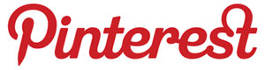
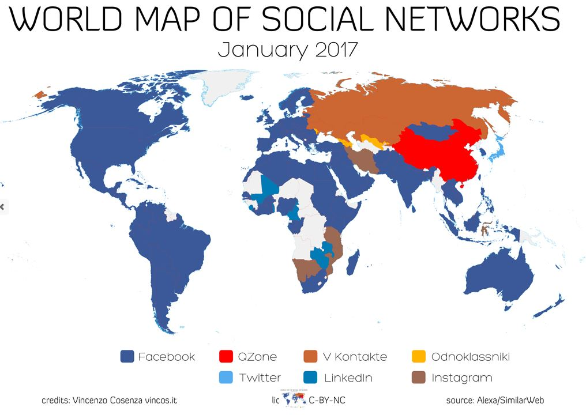
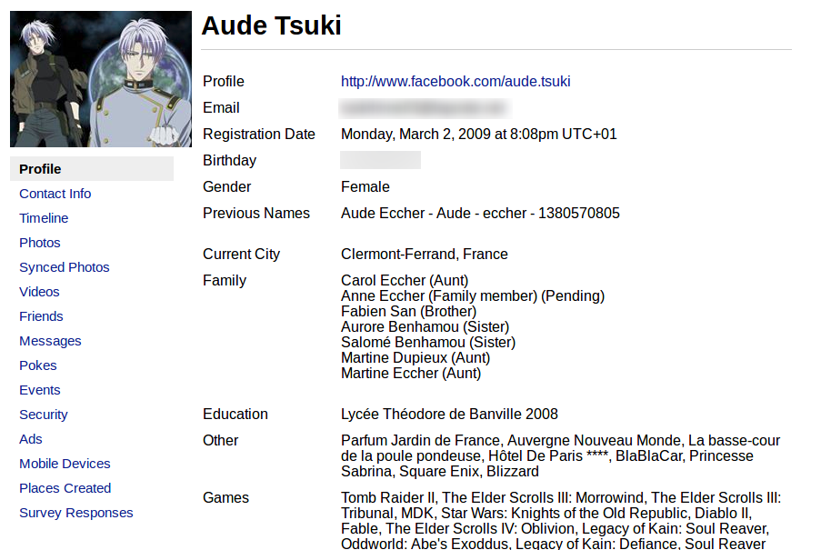

Les Réseaux Sociaux, Sécurité et vie privée

============================================================

* Présentation
	* Formation
	* But de l'atelier
* Définitions
* Présentation des principaux réseaux sociaux
* Débat
	* Atelier hacking
	* Présentation des données présentes sur facebook
* Sécurisation
	* Paramètres facebook
* Présentation des outils de sécurisation et mise en évidence de la collecte de données
	* Terms of use
	* LightBeam
	* Ghostery
* Conclusion

Liste des réseaux sociaux

============================================================

  
**Le principe:** ce réseau permet de partager son status, des photos, des liens et des vidéos. Facebook est aussi utilisé par les entreprises, les artistes pour leur promotion grâce aux pages fans accessibles à tous.  
**Les raisons de s'inscrire:** la communauté est très importante, il est donc très facile d'y retrouver des membres de son entourage. C'est aussi un moyen de communiquer très efficace.  

  
**Le principe:** Twitter est un outil de microblogging qui permet d'envoyer des messages (ou "tweet") de 140 caractères aux internautes qui suivent chaque compte: les "followers" ou abonnés.  
**Les raisons de s'inscrire:** pour suivre l'actualité en direct.  

  
**Le principe:** Instagram est une application mobile de partage de photo.  
**Les raisons de s'inscrire:** on peux retoucher en quelques secondes des clichés grâce à des filtres puis de les partager avec ses amis.  

  
**Le principe:** c'est une application mobile permettant d’envoyer des messages et photos éphémères ainsi que de passer des appels vidéo.  
**Les raisons de s'inscrire:** c'est un moyen idéale de partager avec ses amis, par exemple, ses vacances.  

  
**Le principe:** il permet en effet de communiquer avec vos amis et votre famille en limitant la visibilité de vos messages et photos à un groupe défini de personnes (grâce aux « cercles »).  

  
**Le principe:** ce réseau social professionnel permet de publier et de partager votre CV avec vos amis, et vos collègues.  
**Les raisons de s'inscrire:** la communauté est importante et cela permet d'avoir son CV en ligne sans avoir à créer un site Internet ou un blog.  

  
**Le principe:** Tumblr est une plateforme permettant de publier des textes,  citations, liens, photos, sons et vidéos de manière ultra-simple.  
**Les raisons de s'inscrire:** pas besoin de passer par la création fastidieuse d’un blog mais avec des possibilités intéressantes de customisation au niveau du design de votre page.  

  
**Le principe:** c'est un réseau social de photos. Les photographes, professionnels ou amateurs peuvent y télécharger leur photos. Les comptes gratuits ne peuvent charger qu'un nombre limité de photos.  
**Les raisons de s'inscrire:** Flickr peut servir de portfolio pour les photographes. C'est aussi une incroyable base de données photos grâce au photos libre de droits.  

  
**Le principe:** Pinterest est un réseau social dédié au partage de photos et de vidéos pour amateur ou professionnel.  
**Les raisons de s'inscrire:** possibilité d’accrocher ou plutôt d’épingler (d’où le nom « Pinterest » de « Pins » signifiant épingle en anglais) ses photos préférées sur des « tableaux thématiques » : les boards.  

  
**Le principe:** Myspace a été l'un des premiers et des plus importants réseau social. Les groupes de musique s’en servent encore beaucoup pour diffuser leur musique et s'assurer une présence sur le web.  

  
**Le principe:** c'est tout simplement la plus grande plateforme pour regarder et partager vos vidéos en ligne.  

  
**Le principe:** c'est une plateforme de livestream de jeux vidéos permettant aux joueurs de retransmettre en direct leurs parties et de les commenter.  

**Liste de tous les réseaux sociaux, triés par catégories:** http://www.webmarketing-conseil.fr/liste-reseaux-sociaux/  

Les avantages & les inconvénients des réseaux sociaux

================================================================================

|                                 **Avantages**                                |                  **Inconvénients**                 |
|:----------------------------------------------------------------------------:|:--------------------------------------------------:|
| visibilité                                                                   | visibilité                                         |
| retrouver des contacts                                                       | prédateurs                                         |
| contrôle de son image                                                        | charte (conditions générales)                      |
| notion de partage facilité                                                   | "illusion" de privé                                |
| facilité d'accéssibilité (connection multi-plateformes)                      | addiction                                          |
| accès à l'information (actualités, renseignement sur une entreprise, etc...) | plus de conversations dans la vie réel             |
| possibilité de resteindre certains contenus                                  | les groupes et les pages inutiles et sans intérêts |
|                                                                              | revente de données privées                         |

Les données personnelles

=========================================

